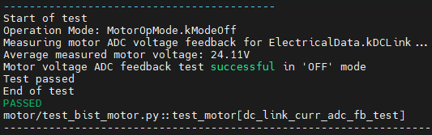
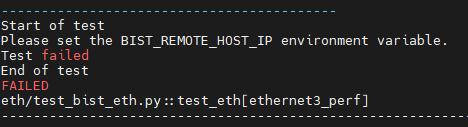
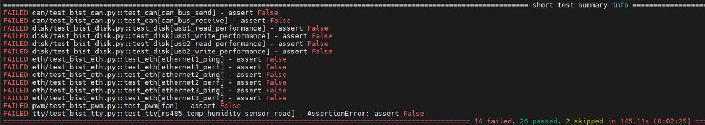

# Built-In Self Test Flow
+ This article mainly explains how to conduct official peripheral function tests on KD240

**Last update: 2024/05/18**
- [ ] **Issue: Currently, it has been found that even after installing Kria-PYNQ, the FOC-related tests cannot be executed successfully**

## Download Ubuntu 22.04
You can download the file from this URL
[Install Ubuntu on AMD | Ubuntu](https://ubuntu.com/download/amd)

​

## Setting Up the SD-Card Image 
Use [balenaEtcher](https://etcher.balena.io/) to burn the downloaded file into the SD card

You can also refer to the official instructions for burning the image

[Setting up the SD Card Image (xilinx.com)](https://www.xilinx.com/products/som/kria/kd240-drives-starter-kit/kd240-getting-started/setting-up-the-sd-card-image.html)


Insert the SD card into the SD card slot of the KD240 as shown in the diagram below


## Power on KD240

Power on according to the diagram below and then open [MobaXtern](https://mobaxterm.mobatek.net/download.html) to communicate with the KD240 via UART


## Set Ubuntu environment and download Xilinx package
### 1. The login credentials are
```
Account: ubuntu
Password: ubuntu
```

### 2. Next, enter the following commands sequentially to update and install the Xilinx Package
```
sudo apt update
sudo apt upgrade
sudo add-apt-repository ppa:xilinx-apps
sudo add-apt-repository ppa:ubuntu-xilinx/sdk
sudo apt update
sudo apt upgrade
sudo snap install xlnx-config --classic --channel=2.x
sudo apt search xlnx-firmware-kd240 ---> Find the BIST firmware by searching "bist" using the command: sudo apt search bist
sudo apt install xlnx-firmware-kd240-bist
```

### 3. Install Kria-PYNQ
+ Installing Kria-PYNQ will also install the dependencies related to FOC Control within the BIST
```
git clone https://github.com/Xilinx/Kria-PYNQ.git
cd Kria-PYNQ
sudo bash install.sh -b KD240
sudo reboot
```

## Load KD240 BIST firmware and Run the Test
### 1. First, unload the previous firmware, and then load the KD240 BIST firmware
```
sudo xmutil unloadapp
sudo xmutil loadapp kd240-bist
```

### 2. Install Docker, and then download the Docker Image for Kria BIST
```
sudo apt-get install docker.io
sudo docker pull xilinx/kria-bist:2023.1
```

### 3. Start Docker
```
sudo docker run \
    --env=DISPLAY \
    --env=XDG_SESSION_TYPE \
    --net=host \
    --privileged \
    --volume=/home/ubuntu/.Xauthority:/root/.Xauthority:rw \
    -v /tmp:/tmp \
    -v /dev:/dev \
    -v /sys:/sys \
    -v /etc/vart.conf:/etc/vart.conf \
    -v /lib/firmware/xilinx:/lib/firmware/xilinx \
    -v /run:/run \
    -it xilinx/kria-bist:2023.1 bash 
```

### 4. Run the tests
```
cd /opt/xilinx/kria-bist/tests
pytest-3 --board kd240
```
You can refer to the detailed options provided in the official documentation for testing

[Setting up the Board and Application Deployment — Kria™ KD240 1.0 documentation](https://xilinx.github.io/kria-apps-docs/kd240/build/html/docs/bist/docs/run.html)

### 5. Test Results
+ Successful Test Items


+ Failed Test Items


+ Test Summary


